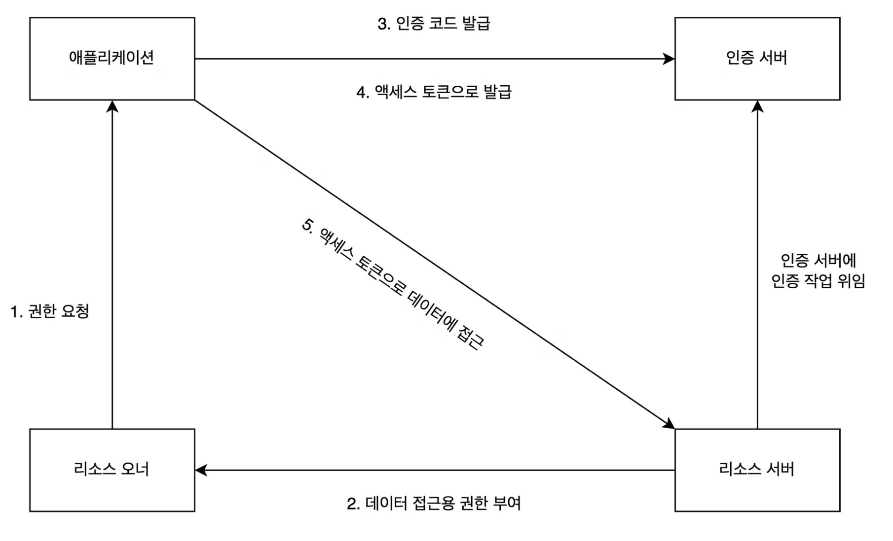
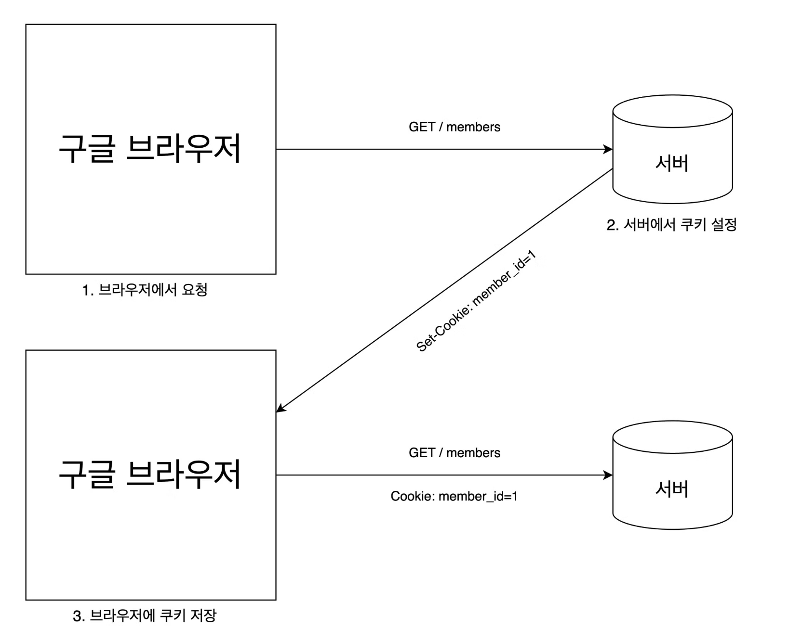

### OAuth란?

OAuth는 제3의 서비스에 계정 관리를 맡기는 방식이다. 흔히 볼 수 있는 네이버로 로그인하기, 구글로 로그인하기 같은 것이다.

- 리소스 오너(resource owner)
    - 자신의 정보를 사용하도록 인증 서버에 허가하는 주체이다. 서비스를 이용하는 사용자가 리소스 오너에 해당된다.
- 리소스 서버(resource server)
    - 리소스 오너의 정보를 가지며, 리소스 오너의 정보를 보호하는 주체를 의미한다. 네이버, 구글, 페이스북이 리소스 서버에 해당한다.
- 인증 서버(authorization server)
    - 클라이언트에게 리소스 오너의 정보에 접근할 수 있는 토큰을 발급하는 역할을 하는 애플리케이션을 의미한다.
- 클라이언트 애플리케이션(client application)
    - 인증 서버에게 인증을 받고 리소스 오너의 리소스를 사용하는 주체를 의미한다. 지금 만들고 있는 서비스가 이에 해당된다.

OAuth를 사용하면 인증 서버에서 발급받은 토큰을 사용하여 리소스 서버에 리소스 오너의 정보를 요청하고 응답받아 사용할 수 있다. 그런데 클라이언트는 어떻게 리소스 오너의 정보를 취득할 수 있을까?
리소스 오너 정보를 취득할 수 있는 방법은 4가지가 있다.

- 리소스 오너 정보를 취득하는 4가지 방법
    - **권한 부여 코드 승인 타입(authorization code grant type)**
        - OAuth 2.0에서 가장 잘 알려진 인증 방법이다. 클라이언트가 리소스에 접근하는 데 사용하며, 권한에 접근할 수 있는 코드와 리소스 오너에 대한 액세스 토큰을 발급받는 방식이다.
    - 암시적 승인 타입(implicit grant type)
        - 서버가 없는 자바스크립트 웹 애플리케이션 클라이언트에서 주로 사용하는 방법이다. 
        클라이언트가 요청을 보내면 리소스 오너의 인증 과정 이외에는 권한 코드 교환 등의 별다른 인증 과정을 거치지 않고 
        액세스 토큰을 제공받는 방식이다.
    - 리소스 소유자 암호 자격증명 승인 타입(resource owner password credentials)
        - 클라이언트의 패스워드를 이용해서 액세스 토큰에 대한 사용자의 자격 증명을 교환하는 방식이다.
    - 클라이언트 자격증명 승인 타입(client credentials grant)
        - 클라이언트가 컨텍스트 외부에서 액세스 토큰을 얻어 특정 리소스에 접근을 요청할 때 사용하는 방식이다.

### 권한 부여 코드 승인 타입이란?


- 권한 요청
    - 클라이언트, 즉, 스프링 부트 서버가 특정 사용자 데이터에 접근하기 위해 권한 서버, 즉, 카카오나 구글 권한 서버에 요청을 보내는 것이다. 
    요청 URI는 권한 서버마다 다르지만 보통은 클라이언트 ID, 리다이렉트 URI, 응답 타입 등을 파라미터로 보낸다.
    
    ```json
    GET spring-authorization-server.example/authorize?
    	client-id=66a36b4c2&
    	redirect_uri=http://localhost:8080/myapp&
    	response_type=code&
    	scope=profile
    ```
    
    - client id
        
        인증 서버가 클라이언트에 할당한 고유 식별자이다. 이 값은 클라이언트 애플리케이션을 OAuth 서비스에 등록할 때 서비스에서 생성하는 값이다.
        
    - redirect_uri
        
        로그인 성공 시 이동해야 하는 URI이다.
        
    - response_type
        
        클라이언트가 제공받길 원하는 응답 타입이다. 인증 코드를 받을 때는 code값을 포함해야 한다.
        
    - scope
        
        제공받고자 하는 리소스 오너의 정보 목록이다.
        
- 데이터 접근용 권한 부여
    - 인증 서버에 요청을 처음 보내는 경우 사용자에게 보이는 페이지를 로그인 페이지로 변경하고 사용자의 데이터에 접근 동의를 얻는다. 이 과정은 최초 1회만 진행된다. 이후에는 인증 서버에서 동의 내용을
    저장하고 있기 때문에 로그인만 진행한다. 로그인이 성공하면 권한 부여 서버는 데이터에 접근할 수 있도록 인증 및 권한 부여를 수신한다.

- 인증 코드 제공
    - 사용자가 로그인에 성공하면 권한 요청 시에 파라미터로 보낸 redirect_uri로 리다이렉션된다. 이 때 파라미터에 인증 코드를 함께 제공한다.
    
    ```json
    GET http://localhost:8080/myapp?code=a1s2f3mcj2
    ```
    

- 액세스 토큰 응답이란?
    - 인증 코드를 받으면 액세스 토큰으로 교환해야 한다. 액세스 토큰은 로그인 세션에 대한 보안 자격을 증명하는 식별 코드를 의미한다. 보통 다음과 같이 /token POST 요청을 보낸다.
    
    ```json
    POST spring-authorization-server.example.com/token
    {
    	"client_id": "66a36b4c2",
    	"client_secret": "aabb11dd44",
    	"redirect_uri": "http://localhost:8080/myapp",
    	"grant_type": "authorization_code",
    	"code": "a1b2c3d4e5f6g7h90"
    }
    ```
    
    - client_secret
        - OAuth 서비스에 등록할 때 제공받는 비밀키
    - grant_type
        - 권한 유형 확인하는데 사용. 이때는 authorization_code로 설정해야 한다. 권한 서버는 요청 값을 기반으로 유효한 정보인지 확인하고, 유효한 정보라면 액세스 토큰으로 응답한다.
        
        ```json
        액세스 토큰 응답 값의 예
        {
        	"access_token": "aasdffb",
        	"token_type": "Bearer",
        	"expires_in": 3600,
        	"scope": "openid profile",
        }
        ```
        

- 액세스 토큰으로 API 응답 & 반환
    - 제공받은 액세스 토큰으로 리소스 오너의 정보를 가져올 수 있다. 정보가 필요할 때마다 API 호출을 통해 정보를 가져오고 리소스 서버는 토큰이 유효한지 검사한 뒤에 응답한다.
    
    ```json
    GET spring-authorization-resource-server.example.com/userinfo
    Header: Authorization: Bearer aasddgdsfa
    ```
    

### 쿠키란?

쿠키란 사용자가 어떠한 웹사이트를 방문했을 때 해당 웹사이트의 서버에서 사용자의 로컬 환경에 저장하는 작은 데이터를 말한다. 이 값이 있기 때문에 이전에 방문한 적이 있는지 알 수 있고, 이전에 로그인을 했다면 로그인 정보도 유지할 수 있는 것이다. 쿠키는 키와 값으로 이루어져 있으며 만료 기간, 도메인 등의 정보를 가지고 있다. HTTP 요청을 통해 쿠키의 특정 키에 값을 추가할 수 있다.



클라이언트가 정보를 요청하면 서버에서 정보를 값으로 넣은 쿠키를 생성해서 요청한 정보, 즉 HTTP 헤더와 함께 돌려보낸다. 그러면 클라이언트는 로컬 즉, 브라우저에 쿠키를 저장한다. 
이후 사이트에 재방문할 때는 사용자가 로컬 환경에 있는 쿠키와 함께 서버에 요청한다. 이렇게 하면 클라이언트에 값을 저장할 수 있기 때문에 현재 사용자 관련 정보를 보여줄 수 있다.