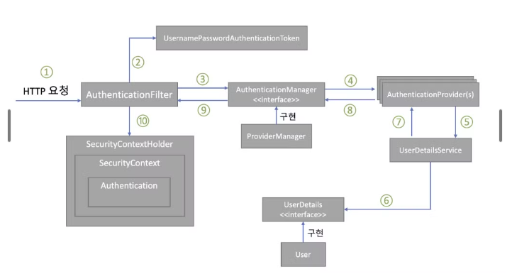

### 인증(Authentication)

인증은 사용자의 **신원을 입증**하는 과정이다. 사이트에 아이디와 비밀번호를 입력하여 로그인 하는 과정이다.

### 인가(Authorization)

‘권한부여'나 ‘허가’와 같은 의미로 사용된다. 어떤 대상이 특정 목적을 실현하도록 허용(Access) 하는 것을 의미한다. 

### 스프링 시큐리티 인증 처리 과정 구성도

1. 사용자가 폼에 아이디, 패스워드를 입력하면 `HTTPServletRequest`에 아이디, 비밀번호 정보가 전달된다. 이때 `AuthenticationFilter`가 넘어온 아이디와 비밀번호의 유효성 검사를 실시하게 된다.
2. 유효성 검사 후 실제 구현체인 `UsernamePasswordAuthenticationToken` 을 만들어 넘겨준다.
3. 인증용 객체인 `UsernamePasswordAuthenticationToken`을 `AuthenticationManager` 에게 넘겨준다.
4. `UsernamePasswordAuthenticationToken` 을 `AuthenticationProvider` 에게 전달한다.
5. 사용자 아이디를 `UserDetailService` 로 보낸다. `UserDetailService` 는 사용자 아이디로 찾은 사용자의 정보를 `UserDetails` 객체로 만들어 `AuthenticationProvider` 에게 전달한다.
6. DB에 있는 사용자 정보를 가져온다.
7. 입력 정보와 `UserDetails` 의 정보를 비교해 실제 인증 처리를 진행한다.
8. ~ 10까지의 인증이 완료되면 `SecurityContextHolder` 에 `Authentication` 을 저장한다. 인증 성공 여부에 따라 성공 시 `AuthenticationSuccessHandler`, 실패 시 `AuthenticationFailureHandler`
핸들러를 실행한다.