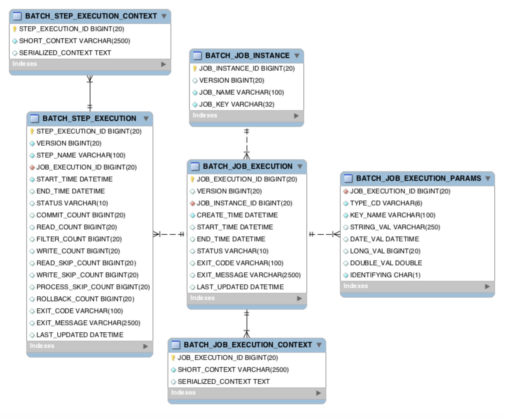

<aside>
💡

**참고링크:**
[https://velog.io/@clevekim/Spring-Batch-메타테이블](https://velog.io/@clevekim/Spring-Batch-%EB%A9%94%ED%83%80%ED%85%8C%EC%9D%B4%EB%B8%94)

</aside>

# Spring Batch 메타테이블

Spring Batch는 Job, Step 및 실행 중인 Batch Job의 상태에 대한 정보를 저장하기 위해 다양한 메타데이터 테이블을 사용한다. 이 문서에서는 Spring Batch 메타데이터 테이블 중 가장 일반적인 것들에 대해 설명한다.

## BATCH_JOB_INSTANCE

BATCH_JOB_INSTANCE 테이블은 실행한 Batch Job의 인스턴스에 대한 정보를 저장한다. Batch Job은 해당 테이블의 레코드를 통해 실행되며, 동일한 Job Parameter로 실행된 Batch Job의 경우 새로운 레코드가 생성되지 않는다.

| JOB_INSTANCE_ID | 실행된 Job을 고유하게 식별될 수 있는 기본 키이다. JobInstance의 getId 메서드를 통해 값을 얻어온다.                                                                                         |
| --------------- | ------------------------------------------------------------------------------------------------------------------------------------------------------------------------------------------ |
| VERSION         | 해당 레코드에 update 될때마다 1씩 증가힌다.                                                                                                                                                |
| JOB_NAME        | JobBuildFactory에서 Job을 빌드할 당시 get메서드를 사용하여 해당 Job의 이름을 부여하는데 그 값(이름)을 기록한다.                                                                            |
| JOB_KEY         | 동일한 Job이름의 JobInstance는 Job의 실행시점에 부여되는 고유한 JobParameter의 값을 통해 식별된다. 그리고 이렇게 식별되는 값의 직렬화(serialization)된 결과를 JOB_KEY라는 값으로 기록된다. |

## BATCH_JOB_EXECUTION

BATCH_JOB_EXECUTION 테이블은 Batch Job 실행에 대한 정보를 저장. 
이 테이블에는 Batch Job의 상태, 시작 및 종료 시간, 실행 중인 Step 등의 정보가 포함.

| JOB_EXECUTION_ID | JobInstance에 대한 실행횟수(JobExecution)를 고유하게 식별할 수 있는 기본 키.                |
| ---------------- | ------------------------------------------------------------------------------------------- |
| VERSION          | DB에 Record가 터치(update)될 때마다 누적된다.                                               |
| JOB_INSTANCE_ID  | 실행된 JobExecution에 대한 실행단위, JobInstance의 키를 기록.                               |
| CREATE_TIME      | 실행(Execution)이 생성된 시점의 TimeStamp를 기록.                                           |
| START_TIME       | 실행(Execution)이 시작된 시점의 TimeStamp를 기록.                                           |
| END_TIME         | 실행이 종료된 시점의 TimeStamp를 기록. 실행 도중 오류가 발생한 경우 값이 비어 있을 수 있다. |
| STATUS           | 실행 상태를 기록. COMPLETED, STARTED, ETC 와 같은 미리 정의된 Enumeration값.                |
| EXIT_CODE        | 실행 종료코드를 기록.                                                                       |
| EXIT_MESSAGE     | Status가 실패(Fail)일 경우 실패한 원인을 문자열형태로 기록.                                 |
| LAST_UPDATED     | Execution이 마지막으로 기록된 시간을 TimeStamp로 기록.                                      |

## BATCH_STEP_EXECUTION

BATCH_STEP_EXECUTION 테이블은 Batch Step 실행에 대한 정보를 저장. 
이 테이블에는 Step의 상태, 시작 및 종료 시간, 처리된 항목 수 등의 정보가 포함.

| STEP_EXECUTION_ID  | Step의 실행횟수정보를 고유하게 식별될할 수 있는 기본 키.                                                                                                  |
| ------------------ | --------------------------------------------------------------------------------------------------------------------------------------------------------- |
| VERSION            | DB에 record가 update될 때 증가.                                                                                                                           |
| STEP_NAME          | StepBuildFactory에서 Step을 빌드할 당시 get메서드를 사용하여 해당 Step의 이름을 부여한 값(이름)을 기록.                                                   |
| JOB_EXECUTION_ID   | Job이 실행될 때마다 그 Job에 정의되어 있는 Step이 실행되고 그 Step의 실행정보가 이 테이블에 저장. StepExecution에 대한 JobExecution의 식별키 정보를 기록. |
| START_TIME         | 실행(Execution)이 시작된 시점의 TimeStamp를 기록.                                                                                                         |
| END_TIME           | 실행이 종료된 시점의 TimeStamp를 기록. '성공', '실패'와 상관없이 끝난 시점을 의미. 실행 도중 오류가 발생한 경우 값이 비어 있을 수 있다.                   |
| STATUS             | 실행의 상태를 기록. COMPLETED, STARTED, ETC와 같은 미리 정의된 Enumeration 값.                                                                            |
| COMMIT_COUNT       | 트랜잭션 당 커밋되는 수를 기록.                                                                                                                           |
| READ_COUNT         | 실행시점에 Read한 Item 수를 기록.                                                                                                                         |
| FILTER_COUNT       | 실행도중 필터링된 Item 수를 기록.                                                                                                                         |
| WRITE_COUNT        | 실행도중 저장되고 커밋된 Item 수를 기록.                                                                                                                  |
| READ_SKIP_COUNT    | 실행도중 Read가 스킵된 Item 수를 기록.                                                                                                                    |
| WRITE_SKIP_COUNT   | 실행도중 write가 스킵된 Item 수를 기록.                                                                                                                   |
| PROCESS_SKIP_COUNT | 실행도중 Process가 스킵된 Item 수를 기록.                                                                                                                 |
| ROLLBACK_COUNT     | 실행도중 rollback이 일어난 수를 기록. 프로시저 복구를 생략하고 재시도된 롤백 건도 포함.                                                                   |
| EXIT_CODE          | 실행 종료코드를 기록.                                                                                                                                     |
| EXIT_MESSAGE       | Status가 실패(Fail)일 경우 실패한 원인을 문자열형태로 기록.                                                                                               |
| LAST_UPDATED       | 실행중에 마지막으로 기록된 시점의 TimeStamp를 기록.                                                                                                       |

## BATCH_JOB_EXECUTION_PARAMS

BATCH_JOB_EXECUTION_PARAMS 테이블은 Batch Job 실행 시 전달된 Job Parameter에 대한 정보를 저장. 이 테이블을 사용하여 Job Parameter 값을 추적하고, 이전 실행과 비교하여 Batch Job 실행의 차이점을 파악할 수 있다.

## BATCH_JOB_EXECUTION_CONTEXT

BATCH_JOB_EXECUTION_CONTEXT 테이블은 Batch Job 실행 중에 생성된 ExecutionContext에 대한 정보를 저장. 이 테이블은 Job Parameter와 함께 사용하여 Batch Job 실행 도중 데이터를 저장하고 공유할 수 있다.

| STEP_EXECUTION_ID  | 기본 키                   |
| ------------------ | ------------------------- |
| SHORT_CONTEXT      | SERIALIZED_CONTEXT의 버전 |
| SERIALIZED_CONTEXT | 직렬화된 전체 컨텍스트    |

