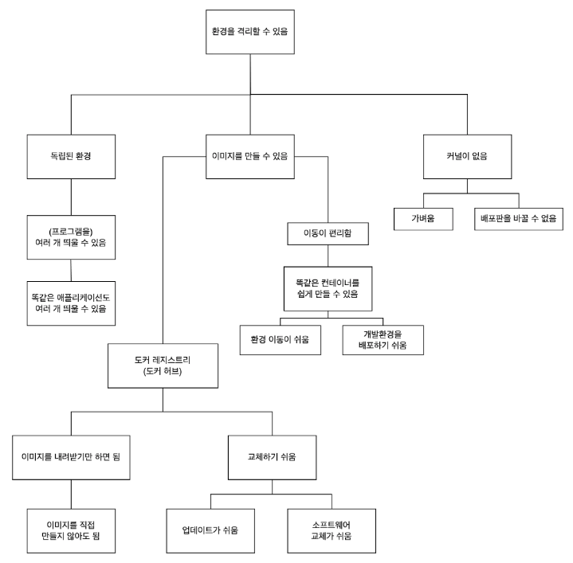

## ‘환경을 격리할 수 있다’는 것이 핵심이다

우선 가장 핵심이 되는 성질은 ‘환경을 격리할 수 있다’는 점이다. 

이러한 성질 덕분에 

1. ‘독립된 환경’ 과 

2. ‘이미지를 만들 수’ 있게 되며 

3. 컨테이너에 ‘커널을 포함시키지 않아도 되는’ 구조가 가능했다.

 

### 독립된 환경

독립된 환경 덕분에 ‘여러 개의 컨테이너를 띄울 수’ 있으며, ‘똑같은 애플리케이션도 여러 개 띄울 수’ 있다.

그중 일부를 교체하거나 수정할 수도 있다.

 

### 이미지를 만들 수 있다

이미지를 만들 수 있다. 그리고 만든 이미지를 ‘도커 허브에서 배포’할 수 있다. 그러므로 모든 이미지를 스스로 처음부터 만들지 않아도 ‘이미지를 내려받기만 하면’ 컨테이너를 사용할 수 있다. 또 구축 작업이 간단해지므로 ‘교체가 쉽고’, ‘업데이트가 쉬운’ 장점도 있다.

 

### 컨테이너에 ‘커널을 포함시킬 필요가 없다’

컨테이너는 커널(운영체제의 핵심이 되는 부분)을 포함시킬 필요가 없으므로 가볍다. 또 배포판도 원하는 것을 사용할 수 있다.

도커를 이해하기 어려운 이유는 이러한 장점만을 나열할 뿐 ‘도커의 어떤 구조로 인해 이러한 장점이 생기는가’에 대해 제대로 설명하지 않기 때문이다.

 

## 도커의 장점

### 한 대의 물리 서버에 여러 대의 서버를 띄울 수 있다

첫 번째 장점은 한 대의 물리 서버에 여러 가지 기능을 안전한 상태로 띄울 수 있다는 점이다. 여러 가지 기능을 띄우는 것 자체는 일반적인 서버로도 가능하다. 하지만 도커는 “격리된 환경”을 제공하므로 이들이 각각 안전한 상태로 실행되며, 일반적인 서버에서는 함께 실행할 수 없는 조합(같은 소프트웨어를 여러 벌 실행하는)도 가능하다.

또, 컨테이너에는 커널이 포함되지 않으므로 물리 서버의 운영체제에 의존한다. 이러한 이유로 소프트웨어적으로 하드웨어를 재현하는 가상화 기술에 비하면 압도적으로 가볍다.

 

### 서버 관리가 용이하다

컨테이너를 이용해 각 소프트웨어를 독립된 환경에 격리하므로 다른 소프트웨어에 영향을 끼치지 않는다. 업데이트도 그만큼 간단하다. 항상 최신 상태로 소프트웨어를 유지하기 쉬운 구조가 된다.

여기에 더불어 컨테이너 교체나 수정이 쉬우므로 환경 이전도 간단하다. 생성 및 폐기가 간단하므로 초기 설정에 따르는 시간과 수고를 들일 필요가 없다. 컨테이너를 수정했다면 이 컨테이너에서 이미지를 만들고 다시 이 이미지로 컨테이너를 대량으로 생성할 수도 있다.

 

### 서버 고수가 아니어도 다루기 쉽다

명령 한 줄로 서버 구축이 끝나므로 ‘터미널에 명령을 직접 입력해야 한다는 것’ 외에는 장애물이 없다. 서버에 대해 잘 모르는 초보자라도 명령어만 익히면 컨테이너를 사용할 수 있다.

 

## 도커의 단점

리눅스 운영체제를 사용하는 기술이므로 리눅스용 소프트웨어밖에 지원하지 않는다. 서버에서는 리눅스 운영체제를 많이 사용하긴 해도 유닉스도 사용할 수 없고 윈도우 서버는 아예 지원하지 않는다.

그리고 물리 서버 한 대에 여러 대의 서버를 띄우는 형태여서 호스트 서버에 문제가 생기면 모든 컨테이너에 영향이 미친다.

이 점은 가상화 기술이나 여러 명의 사용자가 서버를 공유하는 렌탈 서버, 렌탈 클라우드 등의 가상화 플랫폼에서도 마찬가지지만 하나의 물리 서버에 하나의 기능을 띄우는 상태와 비교하면 물리 서버에 문제가 생겼을 때 영향이 미치는 범위가 커진다.

그만큼 물리 서버의 이상에 대해 확실히 대책을 세워야 한다.

또 컨테이너를 여러 개 사용하는 형태를 가정하므로 컨테이너 하나를 장기간에 걸쳐 사용할 때는 그리 큰 장점을 느끼기 어렵다.

애초에 도커를 사용하려면 반드시 도커 엔진을 구동해야 하는데, 컨테이너를 하나밖에 사용하지 않는다면 도커 엔진이 단순한 오버헤드에 지나지 않기 때문이다.

 

## 도커의 주 용도

### 팀원 모두에게 동일한 개발환경 제공하기(=동일한 환경을 여러 개 만들기)

개발환경에서는 팀원 모두에게 동일한 개발환경을 제공할 수 있어 편리하다. 특히 여러 프로젝트에 동시에 참여하는 현장에서는 프로젝트별로 컨테이너를 따로 사용할 수 있다. 컨테이너는 운영환경과 완전히 동일하게 생성되므로 개발환경과 운영환경의 차이가 근본적으로 사라진다.

개발환경으로 사용한 컨테이너는 운영 서버 구축을 담당하는 사람이 만들어 팀원에게 배포한다. 하나의 개발 서버를 공동으로 사용하면 수정으로 인한 경합이 발생할 수 있지만 이런 형태에서는 로컬에서 개발을 마치고 적절한 때에 적용하면 되므로 팀 내에서 조정하면 된다.

 

### 새로운 버전의 테스트(=격리된 환경을 이용)

운영체제나 라이브러리 등의 새로운 버전을 먼저 개발환경에서 테스트한 후 운영환경에 적용할 때도 컨테이너를 활용할 수 있다. 컨테이너 형태를 유지하는 한 도커 엔진이 구동을 보장해 주므로 물리 서버와의 상성은 고려하지 않아도 된다. 새로운 버전뿐만 아니라 변경된 환경에 대한 테스트에도 유용하다.

 

### 동일한 서버가 여러 대 필요한 경우(=컨테이너 밖과 독립된 성질을 이용)

동일한 서버가 여러 대 필요한 경우에도 컨테이너를 이용해 한 대의 물리 서버에 똑같은 서버를 여러 개 만들 수 있다. 이렇게 하면 관리도 간편하고 물리 서버를 여러 개의 컨테이너가 공유하므로 비용도 절약할 수 있다.

명령 한 줄이면 서버를 필요한 만큼 띄울 수 있으므로 운영체제를 설치하고, 로그인한 다음 소프트웨어를 설치하는 단순 업무를 반복할 필요가 없다. 소프트웨어까지 하나로 묶은 패키지를 사용하면 더욱 편리하다.

이 밖에도 스케일링에 유리하므로 웹 서버나 API 서버로 활용하는 등 다양한 활용 방법이 있다.