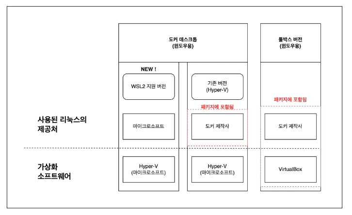

## 도커를 구축하는 세 가지 방법

1. 리눅스 컴퓨터에서 도커 사용하기
2. 가상 머신이나 렌탈 환경에 도커를 설치하고 윈도우나 macOS를 통해 사용하기
3. 윈도우용/macOS 용 도커 사용하기

## 윈도우용/macOS용 도커 사용하기

### 윈도우와 macOS에서는 리눅스 운영체제가 들어있는 패키지(도커 데스크톱)를 사용한다

윈도우와 macOS에서는 각각 ‘윈도우용/macOS 용 도커 데스크톱’이 패키지 형태로 제공된다.

리눅스 컴퓨터에 도커를 설치하려면 도커 엔진만 있으면 되지만 윈도우나 macOS에서는 리눅스 운영체제 등의 실행환경이 추가로 필요하기 때문에 이들을 함께 패키지로 묶어 배포한다.

윈도우용/macOS용이긴 하지만 완전한 윈도우용/macOS 용 소프트웨어는 아니며 윈도우나 macOS에 사용자에게는 보이지 않는 **가상의 리눅스 환경**을 만들고 이 환경에서 도커 엔진을 구동하는 구조다.

위에서 설명한 2번 방법은 사용자가 명시적으로 ‘가상화 소프트웨어를 설치하고, 그 위에 리눅스 운영체제를 설치한 다음 여기에 도커 엔진을 설치’하는 방법으로 구축하는 데 비해 도커 데스크톱은 사용자가 가상화 환경이나 리눅스 운영체제를 신경 쓰지 않고도 도커를 사용할 수 있다.

또한 내부적으로 사용되는 가상화 소프트웨어도 차이가 있다. 2번 방법은 VirtualBox나 VMware 같은 소프트웨어를 사용하는 데 비해 윈도우용 도커 데스크톱은 Hyper-V, macOS용 도커 데스크톱은 HyperKit이라는 가상화 기술을 사용한다. Hyper-V는 윈도우에 포함돼 있으며 HyperKit은 도커 데스크톱 패키지에 포함돼 있다.

### 도커 데스크톱은 일반적인 소프트웨어처럼 사용한다

도커 데스크톱은 설치가 간편할 뿐만 아니라 도커를 사용하면서 **가상화 소프트웨어나 리눅스 운영체제의 존재를 신경 쓰지 않아도 된다**는 특징이 있다.

따로 가상화 소프트웨어와 그 속에 있는 리눅스 운영체제를 실행하는 과정 없이 마치 윈도우나 macOS 에서 동작하는 일반적인 소프트웨어를 사용하듯 사용할 수 있다. 일반적인 소프트웨어처럼 설치하고 더블클릭해서 사용하면 된다.

다만 도커 데스크톱을 실행한 후 실제 도커 엔진을 다룰 때는 드래그 앤드 드롭 같은 마우스를 이용한 조작은 불가능하며, 명령행 인터페이스를 통해 조작해야 한다. 참고로 리눅스 컴퓨터를 사용하든 가상머신 환경을 사용하든 명령행 인터페이스를 사용해야 하는 것은 마찬가지다.

## 운영체제가 두 개라니 괜찮을까?

도커 데스크톱은 우리가 항상 사용하는 윈도우나 macOS와 리눅스 운영체제가 함께 동작한다.

도커를 사용하지 않을 때는 리눅스 운영체제를 따로 신경 쓰지 않아도 되기 때문에 어렵게 생각할 필요도 없고 혼란스러울 필요도 없었다. 말하자면 **도커가 전용으로 사용하는 숨겨진 운영체제**와 같다.

더 이상 사용하지 않게 되어 도커 데스크톱 패키지를 삭제하면 헤딩 리눅스 운영체제도 함께 삭제된다.

## 도커 데스크톱을 사용하기 위한 조건과 데스크톱이 불안정한 경우

문제는 오히려 도커 데스크톱을 사용하기 위한 조건과 간혹 도커 데스크톱이 불안정해지는 경우다. 도커 데스크톱을 사용하려면 윈도우에서는 **Hyper-V(윈도우용 가상환경)가 활성 상태**여야 한다. macOS 에서는 사용 요건 외에 따로 필요한 조건은 없다.

도커 데스크톱이 불안정해지는 증상의 예로는 매우 느려지거나 VirtualBox 또는 VMware 같은 가상화 소프트웨어와 충돌을 일으키는 경우가 있다.

이러한 증상은 도커 데스크톱을 실행하는 가상환경(Hyper-V)이 불안정해 일어나는 문제로서 **윈도우 및 가상화 소프트웨어를 모두 최신으로 업데이트하면 버그가 해결**되겠지만 버전에 따라 충돌이 일어날 가능성이 있다. 업무상 가상환경을 사용하고 있다면 팀장님이나 선배처럼 잘 아는 사람에게 확인한 이후에 사용하는 게 좋다.

> 윈도우용/macOS용 도커 데스크톱을 사용하기 위해 필요한 것
- 사용 조건을 만족하는 윈도우 또는 macOS
> 

> 주의할 점
- 평소에 가상화 소프트웨어를 사용했다면 윈도우와 가상화 소프트웨어를 모두 최신 버전으로 업데이트해야 한다.
> 

## WSL2는 무엇일까? 윈도우 홈 에디션에서도 도커를 사용할 수 있을까?

도커 데스크톱은 윈도우 10 홈 에디션에서는 사용할 수 없고 프로 이상의 버전을 사용해야 한다고 알려져 있다. Hyper-V가 프로에만 포함돼 있기 때문이다.

그러나 윈도우 10의 2020년 봄 업데이트에서 WSL2라는 새로운 기능이 추가됐다. WSL2는 ‘Windows Subsystem for Linux 2’의 약자로, 윈도우에서 리눅스 소프트웨어를 실행하기 위한 기능이다. 이 기능을 이용하면 윈도우 10 홈 에디션에서도 도커 데스크톱을 사용할 수 있다. 즉, 모든 윈도우 10 사용자가 도커 데스크톱을 사용할 수 있게 된 것이다.

이 WSL2 기능은 홈 에디션 사용자 외에도 영향을 받는 사람이 많다.

사실 윈도우용 도커 데스크톱은 두 가지 종류로 나뉜다. 같은 설치 파일을 사용하므로 사용자 입장에서 눈치채기 어려울 수 있지만 도커 제작사에서 만든 리눅스 운영체제를 사용하는 버전(기존 버전)과 마이크로소프트에서 만든 WSL2를 사용하는 버전이 있다.

도커 데스크톱 패키지에는 리눅스가 포함돼 있다. 이 리눅스는 도커 제작사에서 제공한 것이다. 리눅스는 오픈소스이므로 이러한 일이 가능하다.

반면 WSL2 기능이 업데이트되면서 마이크로소프트에서 제공하는 리눅스도 사용할 수 있게 됐다. 다시 말해 패키지에 포함된 도커 제작사에서 제공하는 리눅스와, WSL2와 함께 사용할 수 있는 마이크로소프트에서 제공하는 리눅스를 모두 사용할 수 있다. 윈도우까지 합하면 운영체제가 무려 세 개가 함께 동작하게 된다. 도커 관리 화면에서 이 두 가지 리눅스를 선택해 사용할 수 있다.

## 도커를 실행하기 위한 조건

도커 엔진을 설치하려면 하드웨어 및 운영체제의 조건을 만족해야 한다.

우선 도커는 **64비트 운영체제**에서만 동작한다. 그렇기 때문에 가장 먼저 자신이 사용하는 운영체제가 64비트인지 확인해야 한다. 특히 실무에서 이 부분을 잘 확인해야 한다.

### 운영체제가 64비트인지 확인

컴퓨터에는 32비트 컴퓨터와 64비트 컴퓨터가 있다.

윈도우 버전을 기준으로 윈도우 Vista 이전의 컴퓨터는 32비트, 윈도우 8 이후의 컴퓨터부터는 64비트가 주류를 이룬다. 윈도우 비스타 시절의 컴퓨터라면 지금은 거의 사용하기 힘든 것이 대부분이겠지만 윈도우 7이 쓰이던 시기는 과도기여서 따로 확인해야 한다. 윈도우 10을 사용하는 컴퓨터라도 태블릿이나 스틱형 PC에는 32비트가 아직 남아 있으므로 주의가 필요하다.

### 윈도우 버전의 사용 조건

- 운영체제 요구사항
    - 윈도우 10 64비트 버전: 프로, 엔터프라이즈, 에듀케이션 중 Build 16299 이후 버전
    - 윈도우 10 64비트 버전: 홈 에디션일 경우 WSL2를 사용 가능(2004 버전 이후)
    - Hyper-V 및 Containers가 활성화됨
- 하드웨어 요구사항
    - CPU: SLAT 기능을 지원하는 64비트 프로세서
    - 메모리: 4GB 이상
    - BIOS에서 virtualization이 활성화됨

### macOS 버전의 사용 조건

- 2010년 이후에 발매된 모델
- macOS 10.13(하이 시에라) 이후 버전
- 메모리: 4GB 이상

### 리눅스 버전의 사용 조건

- 배포판 및 버전이 다음 표에 표시된 것 이상이어야 함
- 리눅스 커널: 3.10 이후 버전
- iptables: 1.4 이후 버전
- Git: 1.7 이후 버전
- XZ Utils: 4.9 이후 버전
- procp와 cgroups 계층을 준수

| 배포본 | 버전                    |
|:-----:|:-----:|
| CentOS | CentOS 7 이후           |
| 우분투 | 우분투 16.04 이후       |
| 데비안 | 데비안 9(스트레치) 이후 |
| 페도라 | 페도라 30 이후          |

### 어떤 리눅스의 배포본을 사용?

어떤 리눅스 배포본을 선택해야 할지 망설여본 적이 있을 것이다. 지원하는 배포본 중 자신이 마음에 드는 것을 선택하면 되지만 만약 리눅스에 대해 잘 알지 못하는 사용자라면 **우분투**를 고르면 된다.

도커를 이용해 다루게 될 컨테이너는 데비안 계열의 운영체제 비슷한 것을 사용하는 경우가 많다. 따라서 초보자에게는 데비안 계열이 사용하기 쉽다. 리눅스를 익숙하게 다루지 못하는 독자라면 데비안 계열 중에서도 널리 사용되는 우분투를 추천한다.

- **도커를 이용해 다루는 컨테이너**
    - 공식 컨테이너에서는 알파인 리눅스가 많이 사용된다. 알파인은 군더더기가 거의 없는 작은 크기의 배포본이다.

## 참고

**그림과 실습으로 배우는 도커 & 쿠버네티스**
